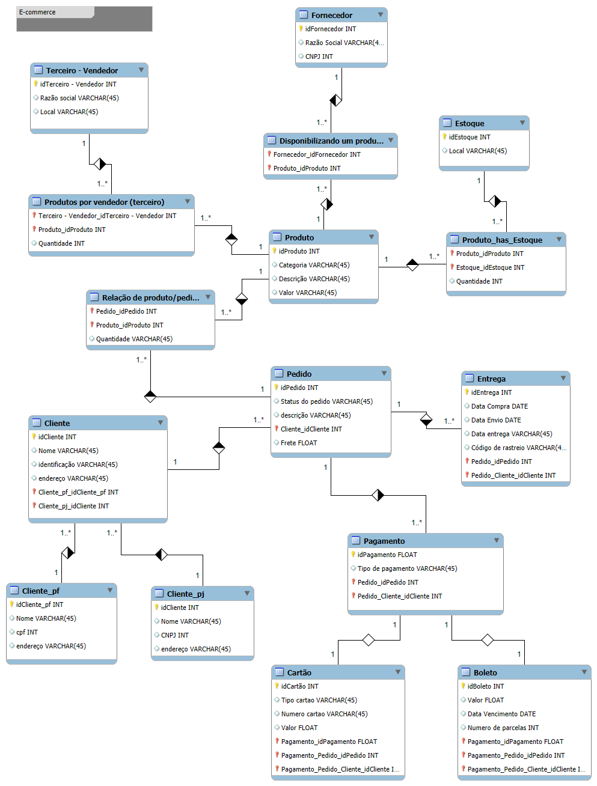

# 📦 Modelo de Banco de Dados para E-commerce

## 📌 Descrição do Projeto
Este projeto apresenta um modelo conceitual refinado para um sistema de e-commerce, contemplando clientes (PF e PJ), formas de pagamento, status de entrega e rastreamento de pedidos. O esquema foi desenvolvido para atender aos requisitos do desafio proposto na Formação [SQL Database Specialist](https://web.dio.me/track/formacao-sql-db-specialist) da [DIO](https://github.com/digitalinnovationone).

## 📊 Estrutura do Banco de Dados
O modelo de banco de dados foi atualizado para incluir os seguintes elementos:

### 1️⃣ **Cliente (Pessoa Física e Pessoa Jurídica)**
- A entidade **Cliente** agora está separada em:
  - **Pessoa Física (PF)**: Nome, CPF, endereço.
  - **Pessoa Jurídica (PJ)**: Nome, CNPJ, endereço.

### 2️⃣ **Pagamento**
- Os clientes podem ter múltiplas formas de pagamento cadastradas.
- Campos principais: ID do Pagamento, Tipo (Crédito, Débito, Boleto, etc.), Dados do Cartão (se aplicável).

### 3️⃣ **Entrega**
- A entidade **Entrega** foi criada para armazenar informações sobre o status e rastreamento dos pedidos.
- Campos principais: ID da Entrega, Status da Entrega (Aguardando, Enviado, Entregue, etc.), Código de Rastreio, Data Prevista.

## 📌 Ferramentas de Modelagem
- [MySQL Workbench](https://www.mysql.com/products/workbench/)

## 📍 Diagrama EER (Enhanced Entity-Relationship Diagram ou Diagrama de Entidade-Relação Melhorado)
 
## 🚀 Melhorias Futuras
- Implementar triggers e stored procedures para regras de negócio.
- Adicionar histórico de status para acompanhar mudanças nos pedidos.
## 💥 Certificado 

##
Feito por **[Pedro Otávio](https://github.com/pedrootaviodiass)**

